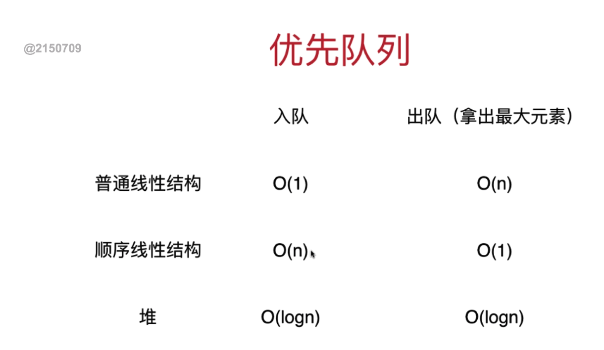
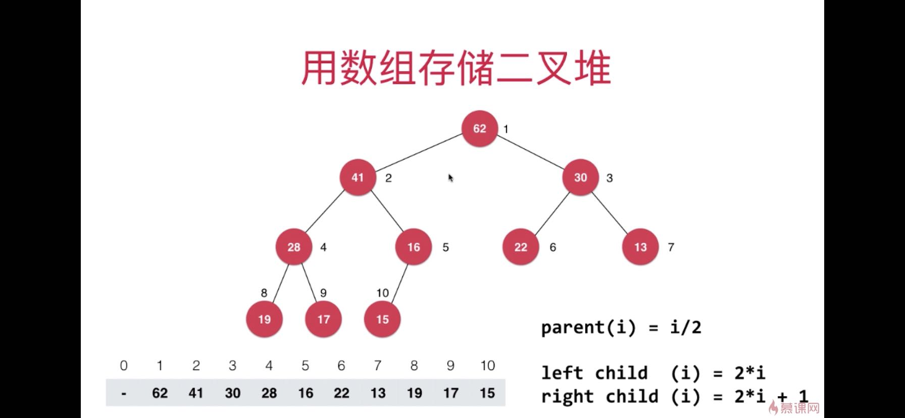

## 章节
* 优先队列
* 不同数据结构实现优先队列的复杂度
* 堆详解
* 堆实现优先队列

## 1. 优先队列
```
优先队列也是队列，入队与普通队列一样，但是出队有优先顺序;
实现队列的底层数据结构有多种，有动态数组，链表均可
```
## 2. 不同数据结构实现优先队列的复杂度


## 3. 堆详解
### 3.1 堆的基本结构
```
1. 堆本身也是一棵二叉树，二叉堆是一棵完全二叉树，
2. 堆中根节点的值是最大(最大堆)的或者最小的(最小堆)
3. 左右节点没有大小关系
4. 子堆也满足上述属性

```
**完全二叉树:** 完全二叉树是缺失了右部分的满二叉树，尽可能的从左至右填满每一层
**满二叉树:** 非叶子节点都有左右节点，且叶子节点都在同一层。

### 3.2 堆的基本实现
用数组存储二叉堆


#### 3.2.1 - 二叉堆元素上浮 sift up
场景:新增一个元素的时候,先将元素添加到数组末尾，并与该元素所在的父亲节点比较大小
```python
def add(self, e):
    self._data.add_last(e)
    self.sift_up(self._data.get_size()-1)

def sift_up(self, index):
    while index > 0 and self._data[self._parent(index)] < self._data[index]:
          self._data.swap(index, self._parent(index))
          index = self._parent(index)
```

#### 3.2.2 - 二叉堆元素下浮
场景: 从堆顶取出一个元素的时候，用末尾元素代替堆中跟节点的元素，此时还是一棵完整的完全二叉树；
进行下浮操作，根节点与左右节点做对比，比孩子节点中最大元素做对比，比孩子节点最大元素小时，交换根节点与子节点中较大的值。

```python


```


## 4.经典面试题:
### 优先队列解决当前问题-top n 问题
在N个元素中选出前M个元素: 时间复杂度是 Nlog(M)
```python

```  


