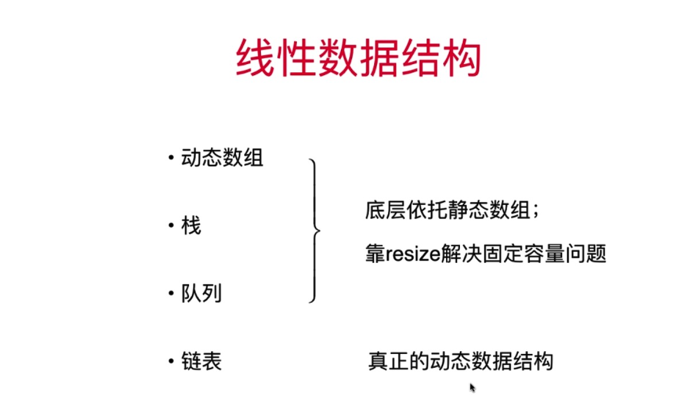

## 章节
* 动态数组 & 栈 & 队列 与 链表的不同
* 链表特性 & 图示
* 链表实现 & 各操作时间复杂度分析

## 动态数组 & 栈 & 队列 与 链表的不同

**重要** 动态数组、栈、队列 底层依托的都是静态数组
链表是天然的动态数据结构

## 链表重要性 & 简介 & 图示
### 重要性:
```
1. 真正的动态数据结构
2. 最简单的动态数据结构
3. 涉及更深入的引用(或者指针)
4. 更深入的理解递归 （天然具有递归属性，node.next is node ）
5. 辅助组成其他数据结构 - 栈、队列也可以用链表实现，还有hashmap
```

## 链表 - LinkedList 
```
1. 数据存储在节点中
class Node {
   // 存储具体的数据
   E e;
   // 指向下一个node的引用
   Node next;
}
```
链表数据结构如下图所示:

**优点:**<br/> 
1.真正的动态，不需要处理固定容量问题
2.增删数据非常方便

**缺点:** <br/> 
1. 丧失了随机访问的缺点

## 链表实现 & 各操作时间复杂度分析
### 链表实现 - python 版

**注意**: 关键点: 找到要插入节点的前一个节点
LinkedList - (head实现)
```python
#!/usr/bin/env python
# -*- coding: utf-8 -*-
"""
# @Time    : 2020/2/5 下午3:44
# @Author  : bofengliu@tencent.com
# @Site    : 
# @File    : LinkedList.py
# @Software: PyCharm
# 自己实现链表元素需要的节点
# head 版
"""


class Node:
    def __init__(self, e=None, next=None):
        self.e = e
        self.next = next

    def to_string(self):
        return self.e


class LinkedList:
    """
    链表中的成员变量，head 指向链表中头节点，size 是链表中元素的个数
    """

    def __init__(self):
        self._head = None
        self._size = 0

    def get_size(self):
        return self._size

    def is_empty(self):
        return self._size == 0

    def add_first(self, val):
        """
        头插法
        :param node:
        :return:
        """
        node = Node(e=val)
        node.next = self._head
        self._head = node
        # 简写
        # self._head = Node(val, self._head)
        self._size += 1

    def add(self, index, e):
        if index < 0 or index > self._size:
            raise (Exception, 'Add failed! Illegal index')
        if index == 0:
            # 这步操作可以通过虚拟头节点屏蔽掉
            self.add_first(e)
        else:
            prev = self._head
            for i in range(0, index - 1):
                prev = prev.next
            new_node = Node(e=e)
            new_node.next = prev.next
            prev.next = new_node
            # 简写
            prev.next = Node(e, prev.next)
        self._size += 1

    def add_last(self, e):
        self.add(self._size, e)
```


LinkedList - (dummy_head 虚拟节点实现)
```python
#!/usr/bin/env python
# -*- coding: utf-8 -*-
"""
# @Time    : 2020/2/5 下午3:44
# @Author  : bofengliu@tencent.com
# @Site    : 
# @File    : LinkedList.py
# @Software: PyCharm
# 自己实现链表元素需要的节点
# dummy_head(虚拟头节点)版
# 删除和新增都需要找到前一个节点
"""


class Node:
    def __init__(self, e=None, next=None):
        self.e = e
        self.next = next

    def to_string(self):
        return self.e


class LinkedList:
    """
    链表中的成员变量，head 指向链表中头节点，size 是链表中元素的个数
    """

    def __init__(self):
        self._dummy_head = Node(None, None)
        self._size = 0

    def get_size(self):
        return self._size

    def is_empty(self):
        return self._size == 0

    def add(self, index, e):
        """
        实质是占用原有index元素的位置，并将原有index元素向后移动
        :param index:
        :param e:
        :return:
        """
        if index < 0 or index > self._size:
            raise (Exception, 'Add failed! Illegal index')

        prev = self._dummy_head
        for i in range(0, index):
            prev = prev.next
        new_node = Node(e=e)
        new_node.next = prev.next
        prev.next = new_node
        # 简写
        # prev.next = Node(e, prev.next)
        self._size += 1

    def add_first(self, e):
        """
        头插法
        :param e:
        :return:
        """
        self.add(0, e)

    def add_last(self, e):
        self.add(self._size, e)

    def get(self, index):
        if index < 0 or index > self._size:
            raise (Exception, 'Get failed! Illegal index')
        # 链表的真实头节点
        cur = self._dummy_head.next
        for i in range(0, index):
            cur = cur.next
        return cur.e

    def get_first(self):
        return self.get(0)

    def get_last(self):
        return self.get(self._size - 1)

    # 更新操作
    def set(self, index, e):
        if index < 0 or index > self._size:
            raise (Exception, 'set failed! Illegal index')
        cur = self._dummy_head.next
        for i in range(0, index):
            cur = cur.next
        cur.e = e

    # 删除操作
    def remove(self, index):
        if index < 0 or index > self._size:
            raise (Exception, 'set failed! Illegal index')
        prev = self._dummy_head
        for i in range(0, index):
            prev = prev.next
        del_node = prev.next
        prev.next = del_node.next
        del_node.next = None
        self._size -= 1
        return del_node.e

    def remove_first(self):
        return self.remove(0)

    def remove_last(self):
        return self.remove(self._size - 1)

    # 查找链表中是否存在某个元素
    def contains(self, e):
        cur = self._dummy_head.next
        while cur is not None:
            if cur.e == e:
                return True
            cur = cur.next
        return False

    def to_string(self):
        res_linkedlist_arr = []
        res_linkedlist_arr.append('LinkedList:size = %d  ' % self._size)
        cur = self._dummy_head.next
        while cur is not None:
            val = cur.e
            if isinstance(val, int):
                val = str(val)
            res_linkedlist_arr.append(val + ' -> ')
            cur = cur.next
        res_linkedlist_arr.append(' NULL ')
        return "".join(res_linkedlist_arr)


if __name__ == '__main__':
    a = 1
    linkedList = LinkedList()
    for i in range(0, 5):
        linkedList.add_first(i)
        print(linkedList.to_string())

    linkedList.set(1, 2)
    print(linkedList.to_string())
    linkedList.add(5, 10)
    print(linkedList.to_string())

    linkedList.remove_first()
    print(linkedList.to_string())

    linkedList.remove_last()
    print(linkedList.to_string())

    linkedList.remove(1)
    print(linkedList.to_string())
```

### 各操作时间复杂度分析
#### add 操作
```
add_last  O(n)  复杂度
add_first O(1)  复杂度
add(index, e) O(n/2) 即 O(n) 的复杂度
```
#### remove 操作
```
remove_last O(n)
remove_first O(1)
remove(index,e) O(n/2) 即 O(n) 的复杂度
```

#### set 操作
```
set(index,e)  O(n)
```

### get 
```
get(index) O(n)
contains(e) O(n)
```
增删改查的时间复杂度都是O(n) 级别的，单对链表头节点(即虚拟头节点的下一个实体节点)，时间复杂度是O(1)


## 改进LinkedList_head 


