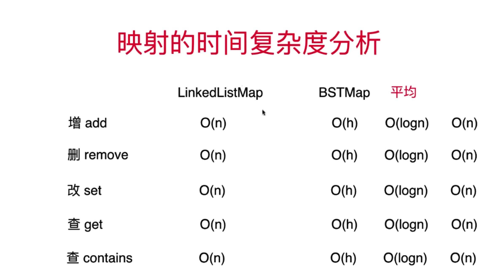

## 章节 
* 映射 Map 
* 基于链表- LinkedList 的映射实现
* 基于二分搜索树- BST 的映射实现
* 链表、二分搜索树实现的映射复杂度分析

## 1. 映射-Map 的基本形态
```
1.Map 是一个顶级容器，map中存储的是键值对元素，key:value
2.Map 中的key 不能重复
```

## 2. 基于链表- LinkedList 的映射实现
```python
#!/usr/bin/env python
# -*- coding: utf-8 -*-
"""
# @Time    : 2020/2/11 上午11:01
# @Author  : bofengliu@tencent.com
# @Site    : 
# @File    : LinkedListMap.py
# @Software: PyCharm
"""


class Node:
    def __init__(self, key=None, val=None, next=None):
        self.key = key
        self.val = val
        self.next = next

    def to_string(self):
        return self.key + ' : ' + self.val


class LinkedListMap:
    def __init__(self):
        self._dummy_head = Node(None, None, None)
        self._size = 0

    def add(self, key, val):
        node = self._get_node(key)
        if node is None:
            self._dummy_head.next = Node(key, val, self._dummy_head.next)
            self._size += 1
        else:
            node.val = val

    def remove(self, key):
        prev = self._dummy_head
        while prev.next is not None:
            if prev.next.key == key:
                break
            prev = prev.next

        if prev.next is not None:
            del_node = prev.next
            prev.next = del_node.next
            del_node.next = None
            self._size -= 1
            return del_node.val
        return None

    def contains(self, key):
        return self._get_node(key) is not None

    def get(self, key):
        node = self._get_node(key)
        if node is not None:
            return node.val
        return None

    def set(self, key, new_val):
        node = self._get_node(key)
        if node is None:
            raise (Exception, key + " doesn't exist!")
        node.val = new_val

    def get_size(self):
        return self._size

    def is_empty(self):
        return self._size == 0

    def _get_node(self, key):
        cur = self._dummy_head.next
        while cur is not None:
            if cur.key == key:
                return cur
            cur = cur.next
        return None
```
**注意:**
设置了 _get_node 辅助函数, contains()、get()、set() 都会用的到

## 3. 基于二分搜索树- BST 的映射实现
```python
#!/usr/bin/env python
# -*- coding: utf-8 -*-
"""
# @Time    : 2020/2/11 上午11:01
# @Author  : bofengliu@tencent.com
# @Site    : 
# @File    : BSTMap.py
# @Software: PyCharm
"""


class Node:
    def __init__(self, key=None, val=None, left=None, right=None):
        self.key = key
        self.val = val
        self.left = left
        self.right = right


class BSTMap:
    def __init__(self, root: Node = None):
        self._root = root
        self._size = 0

    def get_size(self):
        return self._size

    def is_empty(self):
        return self._size == 0

    def contains(self, key):
        return self._get_node(self._root, key) is not None

    def _get_node(self, node, key):
        """
        递归获取 key 对应的 node
        :param node:
        :param key:
        :return:
        """
        if node is None:
            return None

        if node.key == key:
            return node

        if key < node.key:
            return self._get_node(node.left, key)
        if key > node.key:
            return self._get_node(node.right, key)

    def add(self, key, val):
        self._root = self._add_element(self._root, key, val)

    def _add_element(self, root, key, val):
        """
        递归构建二分搜索树
        :param root:
        :param e:
        :return:
        """
        if root is None:
            self._size += 1
            """
            返回的是子树根节点
            """
            return Node(key, val)
        elif key < root.key:
            root.left = self._add_element(root.left, key, val)
        elif key > root.key:
            # insert
            root.right = self._add_element(root.right, key, val)
        else:
            # or update
            root.val = val
        return root

    def get(self, key):
        node = self._get_node(self._root, key)
        if node is None:
            return None
        return node.val

    def set(self, key, new_val):
        node = self._get_node(self._root, key)
        if node is None:
            raise (Exception, key + " doesn't exist!")
        node.val = new_val

    def _minimum(self, node: Node):
        """
        递归-找到二分搜索树中最小元素
        :param node:
        :return:
        """
        if node.left is None:
            return node
        return self._minimum(node.left)

    def _remove_minimum(self, node: Node):
        """
        删除二分搜索树中的最小节点，返回删除节点后新的二分搜索树的根
        :param node:
        :return:
        """
        if node.left is None:
            # 此刻已经遍历到底，当前node为已经遍历到的值
            right_node = node.right
            node.right = None
            self._size -= 1
            return right_node
        node.left = self._remove_minimum(node.left)
        return node

    def remove(self, key):
        """
        从bst 中删除元素为key的节点
        :param key:
        :return:
        """
        node = self._get_node(self._root, key)
        if node is not None:
            self._root = self._remove(self._root, key)
            return node.val
        return None

    def _remove(self, node: Node, key):
        """
        删除以node为根的BST 中节点为e的节点，递归算法
        返回删除节点后新的二分搜索树中的根
        :param node:
        :param key:
        :return:
        """
        if node is None:
            return None
        if key < node.key:
            node.left = self._remove(node.left, key)
            return node
        elif key > node.key:
            node.right = self._remove(node.right, key)
            return node
        else:  # key == node.key
            if node.left is None:
                right_node = node.right
                node.right = None
                self._size -= 1
                return right_node
            if node.right is None:
                left_node = node.left
                node.left = None
                self._size -= 1
                return left_node

            del_node = node
            # 找到后继节点,当前被删除的右子树的最小元素
            next_node = self._minimum(del_node.right)
            next_node.right = self._remove_minimum(del_node.right)
            next_node.left = del_node.left
            del_node.left = del_node.right = None
            return next_node
```
**注意:**
与之前的BST 不同，BST 的数据域e 变成了 key，val;

## 4. 链表、二分搜索树实现的映射复杂度分析
时间复杂度:

**注意:**
二分搜索树在最差情况下会退化成链表，解决这个问题需要用AVL树

## 有序映射 & 无序映射 
有序映射即键是具有顺序性的->基于搜索树实现的 ，无序映射中的键是没有顺序的 


