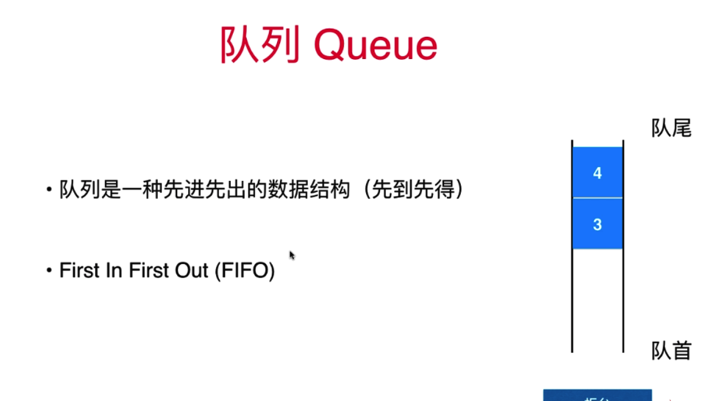
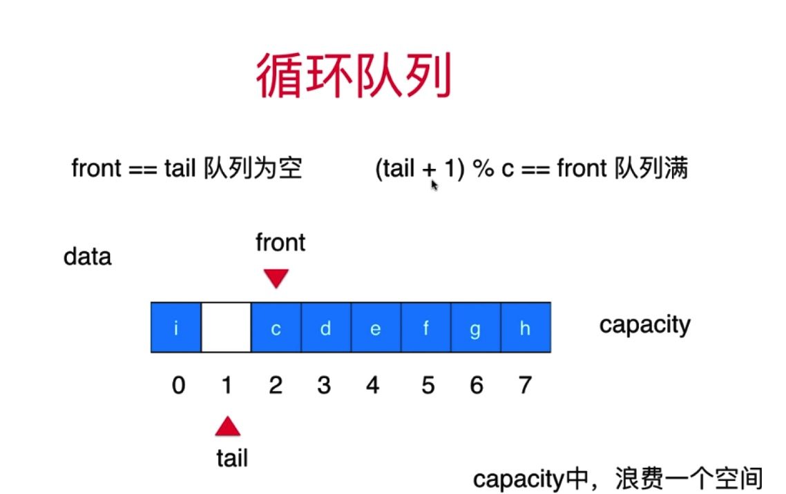

# 章节
* 队列的特性 & 图示
* 数组队列简介与实现
* 循环队列简介与实现

## 队列的特性 & 图示
```
队列是一种FIFO的线性数据结构
```


## 数组队列简介与实现
实现一个数组队列
```
Queue
def enqueue(val): # 入队列 从队尾入队列
def dequeue(): # 出队列 从队首出队列
def get_front(): # 获取 队首元素
def get_size(): # 获取队列元素个数
def is_empty(): # 队列是否为空
```
### ArrayQueue - 基于动态数组实现
```python
#!/usr/bin/env python
# -*- coding: utf-8 -*-
"""
# @Time    : 2020/2/4 下午4:58
# @Author  : bofengliu@tencent.com
# @Site    : 
# @File    : queue.py
# @Software: PyCharm
# 队列 ， 底层同样使用动态数组
# 缺陷: 使用动态数组实现的队列，dequeue 时间复杂度是 O(n)
"""

from array.Array import Array


class ArrayQueue:
    def __init__(self, capacity=None):
        if capacity is None:
            self.array = Array()
        else:
            self.array = Array(capacity)

    def enqueue(self, val):
        """
        队尾入队
        :param val:
        :return:
        """
        self.array.add_last(val)

    def dequeue(self):
        """
        队首出队
        :return:
        """
        return self.array.remove_first()

    def get_front(self):
        return self.array.get_first()

    def get_size(self):
        return self.array.get_size()

    def is_empty(self):
        return self.array.is_empty()

    def to_string(self):
        res_queue_arr = []
        res_queue_arr.append('Queue: front [')
        for i in range(0, self.get_size()):
            val = self.array.get(i)
            if isinstance(val, int):
                val = str(val)
            res_queue_arr.append(val)
            if i != self.get_size() - 1:
                res_queue_arr.append(',')
        res_queue_arr.append('] tail')
        return "".join(res_queue_arr)


if __name__ == '__main__':
    arrayQueue = ArrayQueue()
    for i in range(0, 10):
        arrayQueue.enqueue(i)

    print(arrayQueue.to_string())

    arrayQueue.dequeue()
    print(arrayQueue.to_string())
    arrayQueue.enqueue(1)
    print(arrayQueue.to_string())
    arrayQueue.enqueue(12)
    print(arrayQueue.to_string())

```

## 循环队列简介与实现
数组队列 dequeue 的时间复杂度是 o(n) ,因每次删除队首元素，后面的元素都得进行前移操作
使用循环队列可以将dequeue的时间复杂度降至o(1)

### LoopQueue - 基于python list 实现 
```python
#!/usr/bin/env python
# -*- coding: utf-8 -*-
"""
# @Time    : 2020/2/5 上午11:29
# @Author  : bofengliu@tencent.com
# @Site    : 
# @File    : LoopQueue.py
# @Software: PyCharm
# 不使用动态数组、自己从底层实现循环队列
# 先实现查询、后实现增、删、改, 取余成环
"""


class LoopQueue:
    def __init__(self, capacity=None):
        if capacity is None:
            self._data = [None] * 10
        else:
            self._data = [None] * (capacity + 1)
        # 队首索引
        self._front = 0
        # 队尾索引
        self._tail = 0
        # 元素个数
        self._size = 0

    def get_capacity(self):
        # capacity 浪费一个空间，用来区分 队列空 & 队列满
        return len(self._data) - 1

    def is_empty(self):
        return self._front == self._tail

    def get_size(self):
        return self._size

    def enqueue(self, val):
        # 判断队列是否满, 取余，让队列索引循环起来
        if (self._tail + 1) % len(self._data) == self._front:
            self.resize(self.get_capacity() * 2)

        self._data[self._tail] = val
        self._tail = (self._tail + 1) % len(self._data)
        self._size += 1

    def dequeue(self):
        if self._tail == self._front:
            raise (Exception, 'cannot dequeue from an empty queue.')
        ret = self._data[self._front]
        self._data[self._front] = None
        self._front = (self._front + 1) % len(self._data)
        self._size -= 1

        if self._size == self.get_capacity() / 4:
            self.resize(self.get_capacity() / 2)
        return ret

    def get_front(self):
        if self.is_empty():
            raise (Exception, 'queue is empty')
        return self._data[self._front]

    def resize(self, new_capacity):
        new_data = [None] * (new_capacity + 1)
        for i in range(0, self._size):
            # 原始队列队首元素放在新队列的队首
            new_data[i] = self._data[(i + self._front) % len(self._data)]
        self._data = new_data
        self._front = 0
        self._tail = self._size

    def to_string(self):
        res_queue_arr = []
        res_queue_arr.append('Queue: size = %d, capacity = %d front [' % (self._size, self.get_capacity()))
        index = self._front
        while index != self._tail:
            val = self._data[index]
            if isinstance(val, int):
                val = str(val)
            res_queue_arr.append(val)
            if index != self._tail - 1:
                res_queue_arr.append(',')
            index = (index + 1) % len(self._data)
        res_queue_arr.append('] tail')
        return "".join(res_queue_arr)


if __name__ == '__main__':
    loopQueue = LoopQueue(1)
    print(loopQueue.to_string())
    for i in range(0, 5):
        loopQueue.enqueue(i)
        print(loopQueue.to_string())
    print(loopQueue.to_string())

    loopQueue.dequeue()
    print(loopQueue.to_string())

    loopQueue.dequeue()
    print(loopQueue.to_string())
```


