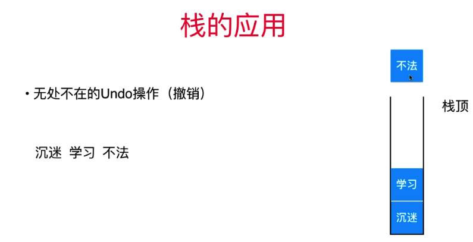
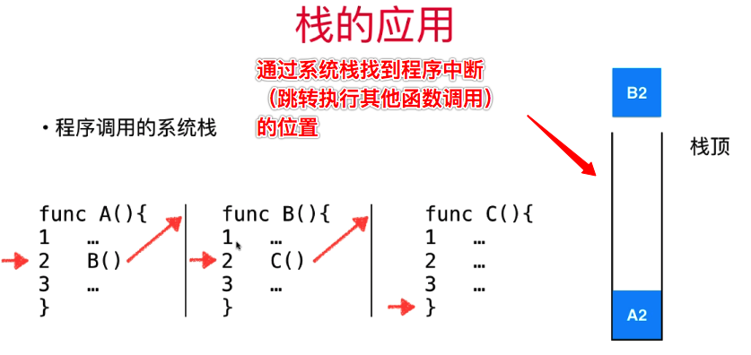

# 章节
* 栈的特性 & 图示
* 栈的应用场景
* 构建一个栈
* 栈的相关操作

# 1. 栈的特性 & 图示
> 栈是一种线性结构
> 相比数据，栈对应的操作是数组的子集
> 只能从一端add元素、get元素，这一端一般称之为栈顶
> LIFO 后进先出

# 2. 栈的应用场景
## 2.1 undo 操作 

比如撤销 "不法" 的输入操作

## 2.2 程序调用的系统栈


## 3. 构建一个栈
stack 基本操作包含以下5个操作api:
```
void  push(obj) -> 入栈操作
obj pop() -> 弹出操作
obj peek() -> pick top 操作(获取栈顶元素)
int getSize() -> 获取栈元素num 操作
bool isEmpty() -> 判断栈是否为空操作
```
底层实现并不关心, 栈通过动态array(capacity 可以动态变化)实现即可，栈的操作是array的子集
 


