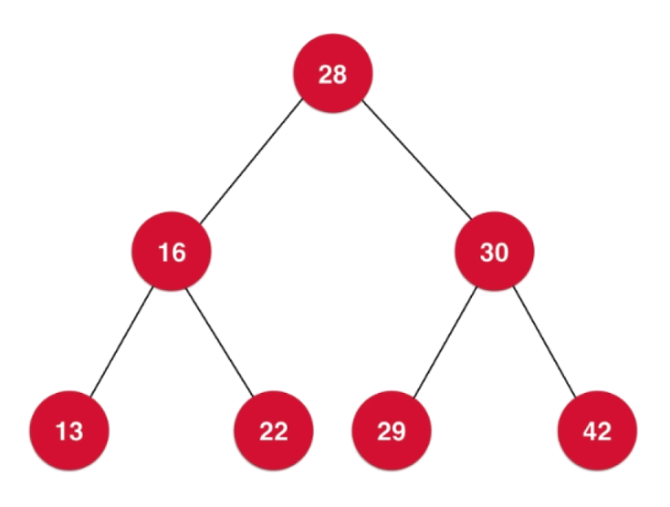
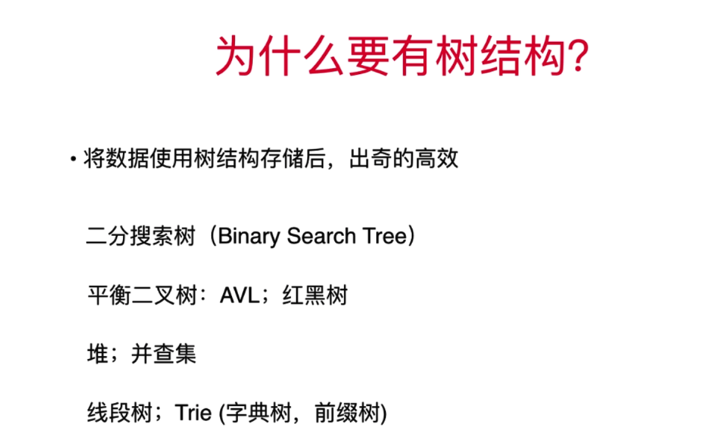
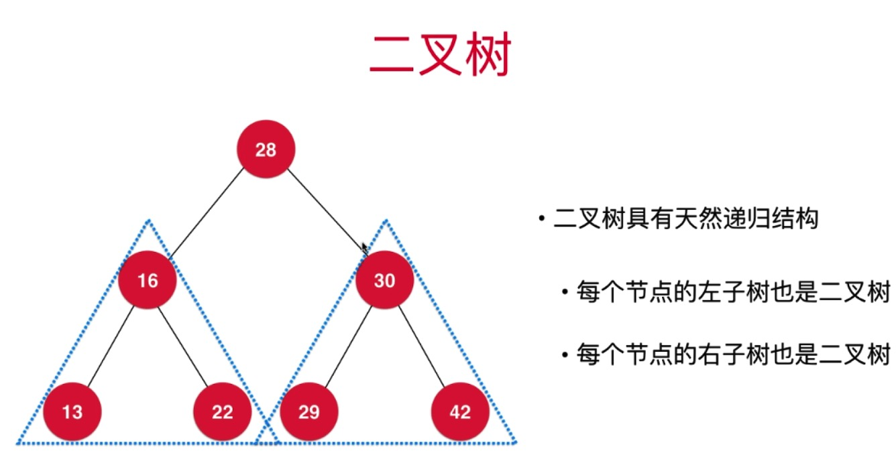
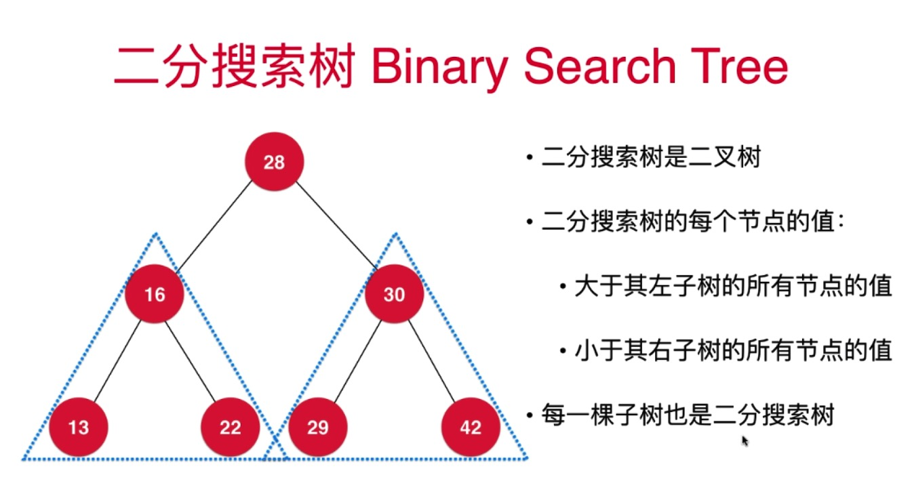
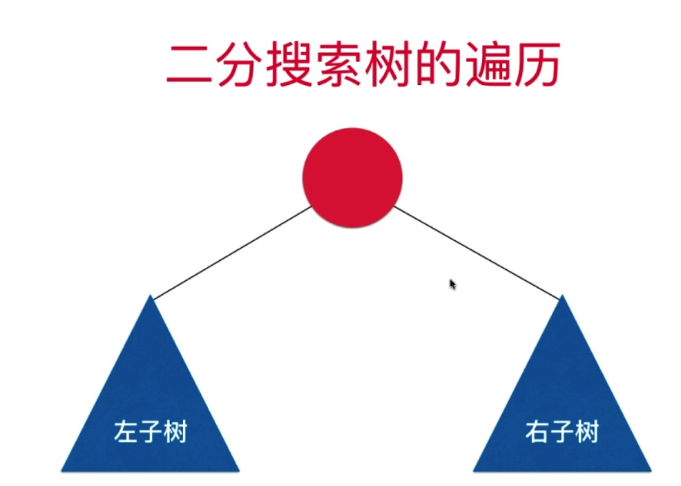
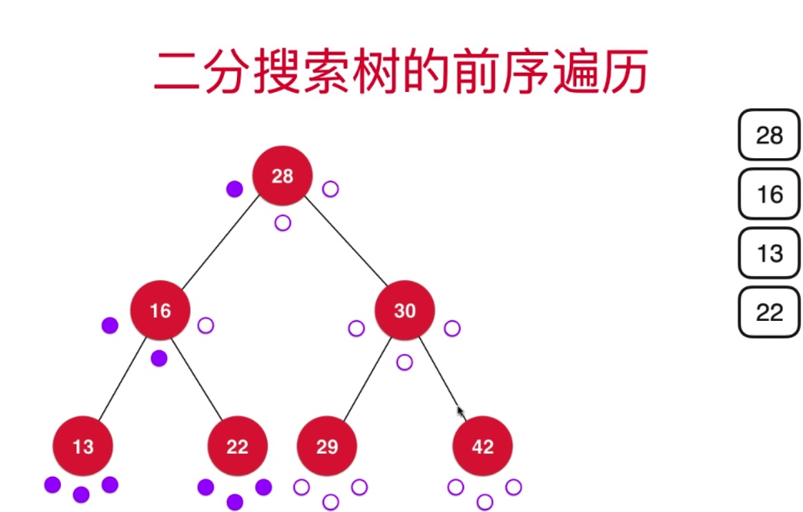

## 章节 
* tree结构简介
* 二叉树详解
* 二分搜索树 - Binary Search Tree


## 1 tree结构简介
### tree-简介
```
tree 是非线性数据结构
tree 是高效的
```


### tree-高效性


## 2 二叉树详解
### 重新认识下tree
```
1. 和链表一样，动态的数据结构
class Node {
    E e;
    Node left;
    Node right;
}
2. 二叉树具有唯一根节点
3. 二叉树中每个节点最多有两个孩子 - 左孩子 or 右孩子
4. 1个孩子都没有的节点叫叶子节点
5. 二叉树每个节点最多又一个父节点
6. 根节点没有父节点
7. 二叉树具有比链表更明显的递归属性
```
**二叉树的天然递归属性**


一个节点有n个分叉- n叉树

### 满二叉树
**定义:** 除了叶子节点，每个节点都有两个孩子节点

**二叉树不一定是满二叉树**

## 3 二分搜索树 - Binary Search Tree
```
1. 二分搜索树是二叉树
2. 二分搜索树每个节点的值:
      大于其左子树所有节点的值
      小于其右子树所有节点的值
      左子树(all node val) < cur node val < 右子树(all node val)
3. 每一棵子树也是二分搜索树
```

二分搜索树-BTS 加速查询过程的原因，假如根节点val = 28, 现在在查找 30 这个元素，因为BTS的存储特性，只需要查找右子树部分就可以了，大大提高了查询的速度
有个细节，需要保证node的val 是可比较的，这是有局限性的
### 3.1 定义树中节点-struct
```python
class Node:
    def __init__(self, e=None, left=None, right=None):
        self.e = e
        self.left = left
        self.right = right
```
节点结构体中 包含数据域 e, 左子树引用 left， 右子树引用right

### 3.2 定义BTS 
```python
class BST:
    def __init__(self, root: Node = None):
        """
        根节点
        :param root:
        """
        self._root = root
        self._size = 0
```
一棵树包班汉一个根节点root，以及node的个数 size

### 3.3  add(e)-递归新增一个节点数据
```python
 def add(self, e):
        self._root = self._add_element(self._root, e)

    def _add_element(self, root, e):
        """
        递归构建二分搜索树
        :param root:
        :param e:
        :return:
        """
        if root is None:
            self._size += 1
            """
            返回的是子树根节点
            """
            return Node(e)
        elif e < root.e:
            root.left = self._add_element(root.left, e)
        elif e > root.e:
            root.right = self._add_element(root.right, e)
        return root
```

### 3.4 contains- 递归查询树中是否包含某个数据
```python
     def contains(self, e):
        return self._contains(self._root, e)

     def _contains(self, node, e):
         if node is None:
            return False
 
         if node.e == e:
            return True

         if e < node.e:
            return self._contains(node.left, e)
         if e > node.e:
            return self._contains(node.right, e)
```

### 3.5 二分搜索树的遍历
#### 3.5.1 前序遍历 - 递归
```python
 def pre_order(self):
        """
        前序遍历
        :return: 
        """
        self._pre_order(self._root)

    def _pre_order(self, node):
        if node is None:
            return

        print(node.e)

        self._pre_order(node.left)
        self._pre_order(node.right)
```

#### 3.5.2 中序遍历-递归
```python
    def in_order(self):
        """
        中序遍历，即是二分搜索树从小到达排序的数据
        :return:
        """
        self._in_order(self._root)

    def _in_order(self, node):
        if node is None:
            return

        self._in_order(node.left)
        print(node.e)
        self._in_order(node.right)
```
#### 3.5.3 后序遍历 post_order - 递归
```python
    def post_order(self):
        """
        后续遍历
        :return:
        """
        self._post_order(self._root)

    def _post_order(self, node):
        if node is None:
            return
        self._post_order(node.left)
        self._post_order(node.right)
        print(node.e)
```
####  3.5.4 前序遍历 - 非递归算法(栈的应用)- DFS 深度优先遍历
LinkedListStack-使用先前实现的链表栈
```python
 def pre_order_nr(self):
        """
        前序遍历-非递归，使用栈 
        :return:
        """
        stack = LinkedListStack()
        stack.push(self._root)
        while stack.is_empty() is False:
            cur = stack.pop()
            print(cur.e)
            if cur.right is not None:
                stack.push(cur.right)
            if cur.left is not None:
                stack.push(cur.left)
```
#### 3.5.5 二分搜索树的层序遍历-(队列的应用) BFS (Breadth First Search)
LinkedListQueue-使用先前实现的链表队列实现层序遍历

```python
    def level_order(self):
        """
        队列实现中序遍历 - 先进先出
        :return:
        """
        queue = LinkedListQueue()
        queue.enqueue(self._root)
        while queue.is_empty() is False:
            cur = queue.dequeue()
            print(cur.e.e)
            if cur.e.left is not None:
                queue.enqueue(cur.e.left)
            if cur.e.right is not None:
                queue.enqueue(cur.e.right)
```





